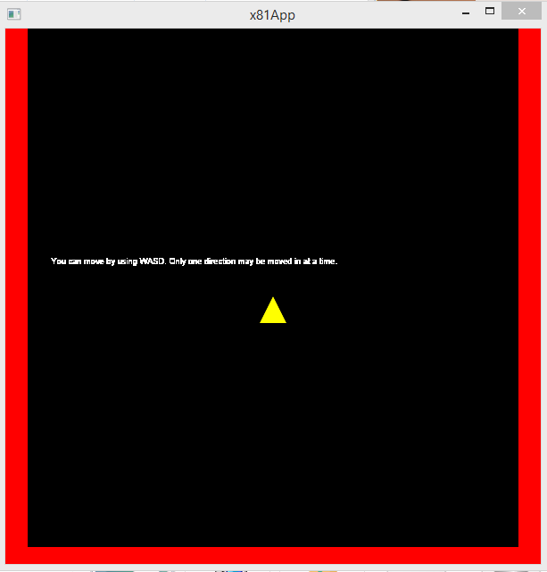
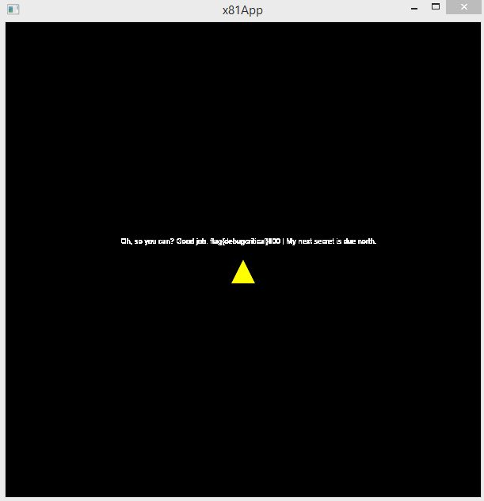
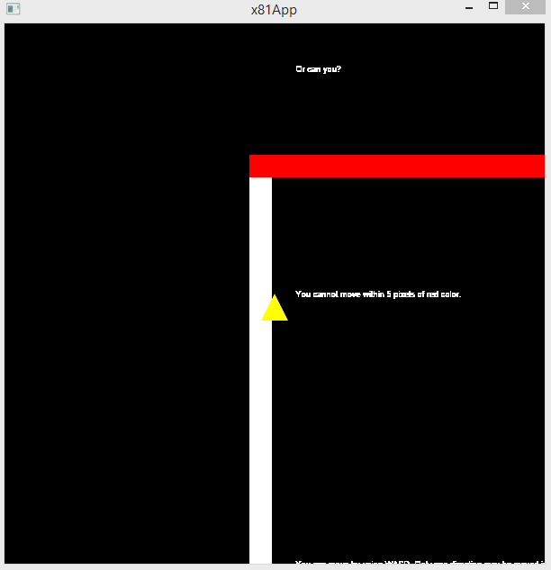
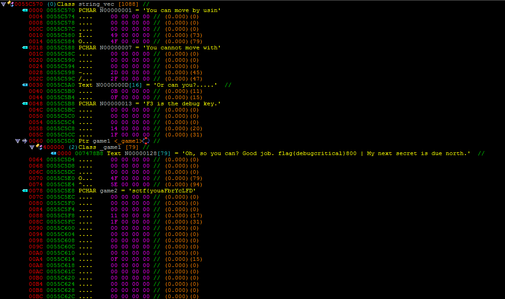

## Introduction To Colors - 50 (Game) ##
#### Writeup by r3ndom_ #####
Created: 2015-12-8

### Problem ###
But can you?

### Hint ###
There seems to be a message if you approach the southern wall pretty closely...

Game is Windows only. :)

## Answer ##

### Overview ###
Figure out how to get out of the red cube to the flag.



There are 5 ways to solve this problem that I have found. 
<br/>
1) Teleport outside of the cube.
<br/>
2) Speed through the walls.
<br/>
3) Make the walls possible to move over.
<br/>
4) Decrypt the flag.
<br/>
5) Get the flag from the std::string vector at runtime.

The first possible way is the most straight forward and is likely the way a majority of people solved this. As such I will cover it first. 

### Details ###

(All done using the first game binary)

To teleport outside the cube you must first notice the text "F3 is the debug key." either in the binary or outside of the cube at the lower left side. Press that and you will get a read out of "coordinates".

These coordinates are not real coordinates but they'll do for now. You can then see what modifies these values. In IDA you would hit 'x' on the symbol to see what else changes it. If you've found this in Cheat Engine or a similar tool you would want to do a data access breakpoint. Cheat Engine packages this up nicely and you can simply right click and "Find out what accesses this address". This will lead you to assembly code that looks like this:

```asm
                mov     eax, [ebp+arg_10]
                cmp     eax, 77h
                jnz     short loc_40901C
                cmp     byte_55C4F0, 0
                jz      loc_4090C2
                sub     dword_55C4FC, 2
                add     dword_55C568, 2
                add     dword_55C56C, 2
                mov     dword_55C4F4, 1
                jmp     loc_4090C2
; ---------------------------------------------------------------------------

loc_40901C:                             ; CODE XREF: MoveFn+9j
                cmp     eax, 73h
                jnz     short loc_40904F
                cmp     byte_55C4F0, 0
                jz      loc_4090C2
                add     dword_55C4FC, 2
                sub     dword_55C568, 2
                sub     dword_55C56C, 2
                mov     dword_55C4F4, 2
                jmp     short loc_4090C2
; ---------------------------------------------------------------------------

loc_40904F:                             ; CODE XREF: MoveFn+3Fj
                cmp     eax, 61h
                jnz     short loc_40907E
                cmp     byte_55C4F0, 0
                jz      short loc_4090C2
                sub     dword_55C4F8, 2
                add     dword_55C560, 2
                add     dword_55C564, 2
                mov     dword_55C4F4, 3
                jmp     short loc_4090C2
; ---------------------------------------------------------------------------

loc_40907E:                             ; CODE XREF: MoveFn+72j
                cmp     eax, 64h
                jnz     short loc_4090AD
                cmp     byte_55C4F0, 0
                jz      short loc_4090C2
                add     dword_55C4F8, 2
                sub     dword_55C560, 2
                sub     dword_55C564, 2
                mov     dword_55C4F4, 4
                jmp     short loc_4090C2
```

So this code is pretty clear exactly what its doing, its called with a keycode to indicate what key you're pressing and then moves the character and sets the character orientation as such.

dword_55C4F4 is the orientation and each other var in there is either player location, camera location, or the debug location. 

You simply have to teleport youself up to where the flag is.

Alternative methods to solving this will be covered lightly below.

### Flag ###



    flag{debugcritical}

### Alternative Methods ###

To speed through the walls you modify the opcodes of the assembly covered above to something less than 126 to avoid going backwards (the bytes are signed) and get close to a wall then hop over it.

To make the walls possible to move over you need to find the wall drawing code where the wall structure array is.

```asm
loc_4093A0:                             ; CODE XREF: drawfn+97j drawfn+160j
                mov     eax, ds:danger_walls[esi]
                cmp     eax, 1
                jnz     short loc_4093B3
                xorps   xmm1, xmm1
                xorps   xmm0, xmm0
                jmp     short loc_4093C8
```

This is the code that messes with the, what I called, danger_walls (really part of the walls structure array) array. This contains something that simply says whether the wall kills you. I changed the left wall to 10 rather than 1 and it does this:



Decrypting the flag requires reversing the decryption algo, found in the function called to draw this text. It is much easier to do the next method.

The function for drawing these strings has an array where it stores the values of all the draw strings. This can be found by breakpointing the function for drawing text and grabbing the object pointer the first time it draws text for the map. This object pointer is the pointer to the array of `std::string`s that you can read and use for getting the flag.



Note how its using short string optimization and the text length is held in the structure. Clearly an `std::string`. Also the game 2 in there is not the most recent game 2.
