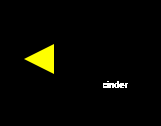
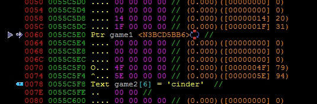

## Moving North - 75 (Game) ##
#### Writeup by r3ndom_ #####
Created: 2015-12-8

### Problem ###
Seems pretty far... How can I move quicker?

### Hint ###
Game is Windows only. :)

**Update**: Problem is a bit easier now, try finding the flag again, this time it will make more sense. (don't forget to re-download the new executable) :)

## Answer ##

### Overview ###
Literally move north.

Methods to solve:
1) Go north fast.
2) Move your camera to the right position ( or just fast ).
3) Decrypt the string.
4) Find the flag in the std::string array.

### Details ###

The problem is referncing this text which directs you north. Your objective is to go north and find the flag.

Simplest method is changing the speed as I referenced in the write up for [Introduction to Colors](). And then go straight north from the flag for the previous problem and in a few minutes you will find the flag.

### Flag ###

    cinder

### Alternative Methods (in brief) ###

Teleporting is a risky prospect mainly because you don't know where to teleport to, however it can be faster than moving. Just teleport forward a bunch.

Decrypting the string would require reversing the string decryption method. 

Finding the flag in the std::string array is simple enough. Just do what I explained in Introduction to Colors and then scroll down in memory.

