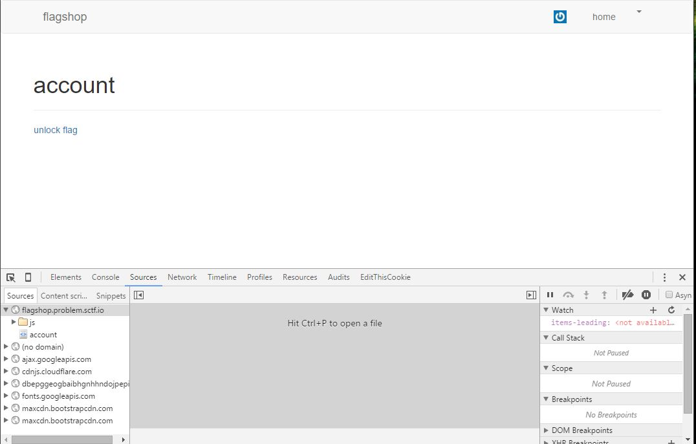
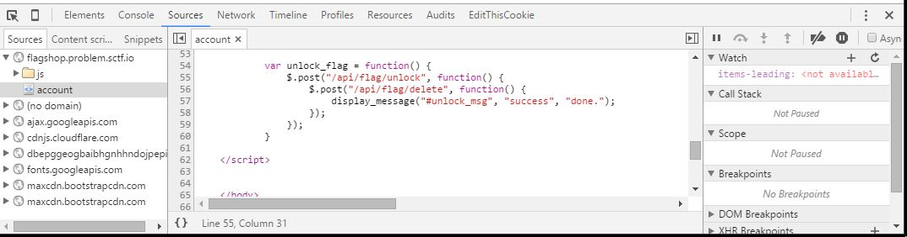

## The Flag Shop - 50 (Web Exploitation) ##

#### Write-up by Oksisane


### Problem ###

Go get the flag! http://flagshop.problem.sctf.io

### Hint ###
How can you prevent it from calling delete?

## Answer ##

### Overview ###

Post a request to `/api/flag/unlock` without posting to `/api/flag/delete`

### Details ###
If we create an account on the flagshop site and browse to the account page, some interesting JavaScript is located at the bottom.
```javascript		
var unlock_flag = function() {
    $.post("/api/flag/unlock", function() {
        $.post("/api/flag/delete", function() {
            display_message("#unlock_msg", "success", "done.");
        });
    });
}
```
It seems like when the `unlock flag` button is pressed the flag is unlocked but then immediately deleted due to the second call. One way to stop this from happening is a breakpoint.

A breakpoint is a marker that you can set on a piece of code. When the web browser reaches that piece of code it will pause (break), and allow you to stop the code flow. If we can pause the code flow just after `/api/flag/unlock` but before `/api/flag/delete` the flag will still exist when we refresh the page!

Let's get started (I`ll be doing this in Chrome)

First, open Chrome's debugging console and browse to the sources tab using the f12 key.



Next, browse to the code location by clicking the `account` button and scrolling down till you see `			$.post("/api/flag/delete", function() {`



Finally click the line number of `$.post("/api/flag/delete", function() {` to set the breakpoint


Now if you click `unlock flag` it should breakpoint the code at the call to `/api/flag/delete` instead of running it! Sucess! Reloading the page  gives the flag.

### Flag ###

	flag{1d5d38e5f226e32bd4dfce55}
